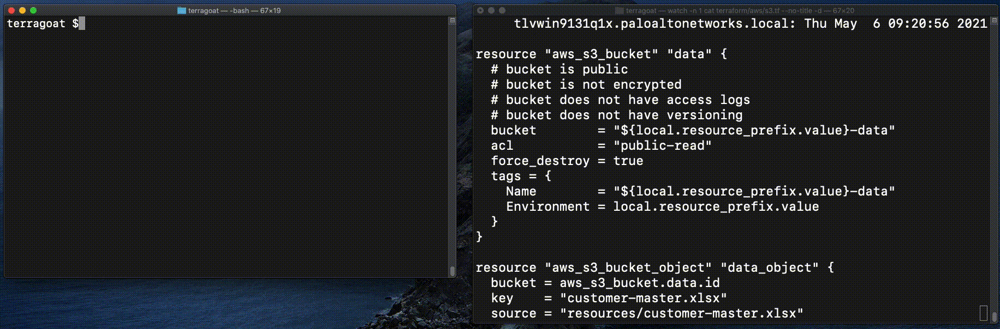
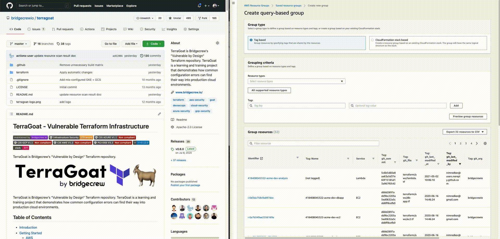
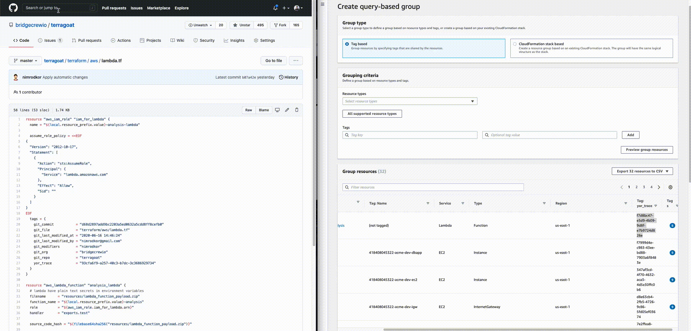
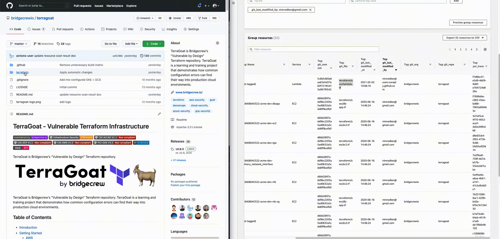

[](https://bridgecrew.io/?utm_source=github&utm_medium=organic_oss&utm_campaign=yor)

[](https://github.com/bridgecrewio/yor/actions/workflows/security.yml)
<a href='https://github.com/jpoles1/gopherbadger' target='_blank'></a>
[](https://slack.bridgecrew.io/)
[](https://goreportcard.com/report/github.com/bridgecrewio/yor)
[](https://pkg.go.dev/github.com/bridgecrewio/yor)
[](https://hub.docker.com/r/bridgecrew/yor)
[](https://community.chocolatey.org/packages/yor)
[](https://github.com/bridgecrewio/yor/releases)

Yor is an open-source tool that helps add informative and consistent tags across infrastructure-as-code frameworks such as Terraform, CloudFormation, and Serverless.

Yor is built to run as a [GitHub Action](https://github.com/bridgecrewio/yor-action) automatically adding consistent tagging logics to your IaC. Yor can also run as a pre-commit hook and a standalone CLI.

## Features
* Apply tags and labels on infrastructure as code directory
* Tracing: ```yor_trace``` tag enables simple attribution between an IaC resource block and a running cloud resource.
* Change management: git-based tags automatically add org, repo, commit and modifier details on every resource block.  
* Custom taggers: user-defined tagging logics can be added to run using Yor.
* Skips: inline annotations enable developers to exclude paths that should not be tagged.
* Dry-Run: get a preview of what tags will be added without applying any.

## Demo
[](https://raw.githubusercontent.com/bridgecrewio/yor/main/docs/yor_tag_and_trace_recording.gif)

<!-- ### Attributing a directory with tags by user input
[](https://raw.githubusercontent.com/bridgecrewio/yor/main/docs/yor_terragoat_simple.gif)

### Attributing a resource to an owner
[](https://raw.githubusercontent.com/bridgecrewio/yor/main/docs/yor_owner.gif)

### Change management tags
[](https://raw.githubusercontent.com/bridgecrewio/yor/main/docs/yor_git_tags.gif)

### Trace IaC code to cloud resource
[](https://raw.githubusercontent.com/bridgecrewio/yor/main/docs/yor_trace.gif)

### Trace cloud resource to IaC code
[](https://raw.githubusercontent.com/bridgecrewio/yor/main/docs/yor_file.gif) -->

## **Table of contents**

- [Getting Started](#getting-started)
- [Support](#support)
- [Customizing Yor](CUSTOMIZE.md)

## Getting Started

### Installation
MacOS / Linux
```sh
brew tap bridgecrewio/tap
brew install bridgecrewio/tap/yor
```
__OR__

Windows
```sh
choco install yor
```

__OR__

Docker
```sh
docker pull bridgecrew/yor

docker run --tty --volume /local/path/to/tf:/tf bridgecrew/yor tag --directory /tf
```


GitHub Action
```yaml
name: IaC trace

on:
  # Triggers the workflow on push or pull request events but only for the main branch
  push:
    branches: [ main ]
  pull_request:
    branches: [ main ]

  # Allows you to run this workflow manually from the Actions tab
  workflow_dispatch:

jobs:
  yor:
    runs-on: ubuntu-latest
    steps:
      - uses: actions/checkout@v2
        name: Checkout repo
        with:
          fetch-depth: 0
          ref: ${{ github.head_ref }}
      - name: Run yor action and commit
        uses: bridgecrewio/yor-action@main
```


Pre-commit
```yaml
  - repo: git://github.com/bridgecrewio/yor
    rev: 0.0.44
    hooks:
      - id: yor
        name: yor
        entry: yor tag -d
        args: ["example/examplea"]
        language: golang
        types: [terraform]
        pass_filenames: false
```

### Usage

`tag` : Apply tagging on a given directory.

```sh
 # Apply all the tags in yor on the directory tree terraform.
 yor tag --directory terraform/

# Apply all the tags in yor except the tags git_last_modified_by and yor_trace.
 yor tag --directory terraform/ --skip-tags git_last_modified_by,yor_trace

# Apply only the tags under the git tag group.
 yor tag --tag-groups git --directory terraform/

# Apply key-value tags on a specific directory
 export YOR_SIMPLE_TAGS='{ "Environment" : "Dev" }'
 yor tag --tag-groups simple --directory terraform/dev/

```

`-o` : Modify output formats.

```sh
yor tag -d . -o cli
# default cli output

yor tag -d . -o json
# json output

yor tag -d . --output cli --output-json-file result.json
# print cli output and additional output to file on json file -- enables programmatic analysis alongside printing human readable result
```

`--skip-tags`: Specify only named tags (allow list) or run all tags except those listed (deny list).

```sh
yor tag -d . --skip-tags yor_trace
## Run all but yor_trace

yor tag -d . --skip-tags yor_trace,git_modifiers
## Run all but yor_trace and git_modifiers

yor tag -d . --skip-tags git*
## Run all tags except tags with specified patterns
```

`skip-dirs` : Skip directory paths you can define paths that will not be tagged.

```sh
yor tag -d path/to/files
## Run on the directory path/to/files

yor tag -d path/to/files --skip-dirs path/to/files/skip,path/to/files/another/skip2
## Run yor on the directory path/to/files, skipping path/to/files/skip/ and path/to/files/another/skip2/
```

`list-tag`

```sh
yor list-tag-groups
 # List tag classes that are built into yor.

yor list-tags
 # List all the tags built into yor
yor list-tags --tag-groups git

 # List all the tags built into yor under the tag group git
```

`dry-run`
```sh
yor tag -d . --dry-run
# Perform a dry run to get a preview in the CLI output of all of the tags that will be added using Yor without applying any changes to your IaC files.
```
### What is Yor trace?
yor_trace is a magical tag creating a unique identifier for an IaC resource code block.

Having a yor_trace in place can help with tracing code block to its cloud provisioned resources without access to sensitive data such as plan or state files.

See demo [here](https://yor.io/4.Use%20Cases/useCases.html)
## Contributing

Contribution is welcomed!

We are working on extending Yor and adding more parsers (to support additional IaC frameworks) and more taggers (to tag using other contextual data).

To maintain our conventions, please run lint on your branch before opening a PR. To run lint:
```sh
golangci-lint run --fix --skip-dirs tests/yor_plugins
```

## Support

For more support contact us at https://slack.bridgecrew.io/.
