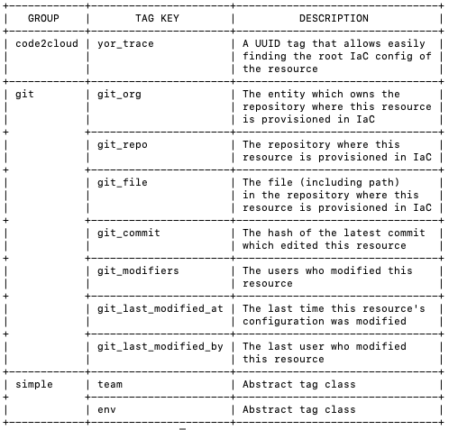

# Creating and Applying Custom Tags
Using custom tags allows organizations to tag resources to match the development cycle, development flow, or the organization's structure.

Yor supports several ways of adding custom tags:
1. [Using Environment Variables - Simple tags with constant key-value](#adding-simple-tags-using-environment-variables)
2. Using Go built-in classes -
	1. [Simple code-based tags](#adding-simple-code-based-tags)
	2. [Complex tags that rely on different inputs](#adding-complex-tags)
3. [Using YAML configuration files](../3.Custom Taggers/Custom_tagger_YAML.md#custom-tagger-using-yaml-configuration-files)
4. [Using CLI commands](../3.Custom Taggers/Custom_tagger_YAML.md#custom-tagger-using-yaml-configuration-files)
       
Examples can be found in [`tests/yor_plugins`](https://github.com/bridgecrewio/yor/tree/main/tests/yor_plugins)

## Adding Simple Tags Using Environment Variables
To add tags with constant key-value pairs, set the environment variable `YOR_SIMPLE_TAGS`
with a JSON object detailing all key value pairs. For example:
```sh
export YOR_SIMPLE_TAGS='{"somekey": "somevalue", "another-key": "another_val"}'
# When yor is run, all resources will be tagged by these two tags as well.
```

For instance, running -
```sh
export YOR_SIMPLE_TAGS='{"team": "devops", "env": "prod"}'
```
will add these tags as part of yor run, as shown once running `./yor --list-tags` command:


## Adding Custom Tags Using Golang
Use the following code samples to add tags using Go. 

### Adding Simple Code Based Tags
1. Create tags implementing the `ITag` interface.
2. To override an existing tag, make the tag's method `GetPriority()` return a positive number, otherwise return `0`, or a negative number.
3. Create a file in the package `main` that exposes an array variable (for example `ExtraTags`) containing pointers to all the tags implemented. 
   For example:
    ```go
    package main
    
    var ExtraTags = []interface{}{&TerragoatTag{}, &CheckovTag{}}
    ```
4. Run `go build -gcflags="all=-N -l" -buildmode=plugin -o <plugin-dir>/extra_tags.so <plugin-dir>/*.go`

For examples see the [example](https://github.com/bridgecrewio/yor/tree/main/tests/yor_plugins/example) file.

### Adding Complex Tags
1. Create a tagger struct, implementing the `ITagGroup` interface.
2. Implement the `InitTagGroup` method. For example:
    ```go
    func (d *CustomTagger) InitTagGroup(_ string, skippedTags []string) {
	    d.SkippedTags = skippedTags
	    d.SetTags([]tags.ITag{}) // This is just a placeholder
    }
    ```
3. Implement the `CreateTagsForBlock` method. For example:
    ```go
   func (d *CustomTagger) CreateTagsForBlock(block structure.IBlock) {
        var newTags []tags.ITag
        for _, tag := range d.GetTags() {
            tagVal, err := tag.CalculateValue(<Whichever struct you choose to pass to the tagger>)
            if err != nil {
                logger.Error(fmt.Sprintf("Failed to create %v tag for block %v", tag.GetKey(), block.GetResourceID()))
            }
            newTags = append(newTags, tagVal)
        }
        block.AddNewTags(newTags)
   }
    ```
4. Implement the tags which implement the `ITag` interface. For example, see [Adding Simple Code Based Tags](#adding-simple-code-based-tags).
5. Go back to the `InitTagGroup` method and add pointers to your new tags in the input of the `SetTags` function call.
6. Create a file in package `main` that exposes an array variable (for example `ExtraTags`) containing pointers to all the tags implemented. 
   For example:
    ```go
    package main
    
    var ExtraTaggers = []interface{}{&CustomTagger{}}
    ```

For examples see the [example](https://github.com/bridgecrewio/yor/tree/main/tests/yor_plugins/example) file.

## Running Yor with Custom Taggers
Use the following example to run Yor with the Custom Taggers:
```sh
./yor tag --custom-tagging tests/yor_plugins/example
# run yor with custom tags located in tests/yor_plugins/example

./yor tag --custom-tagging tests/yor_plugins/example,tests/yor_plugins/tag_group_example
# run yor with custom tags located in tests/yor_plugins/example and custom taggers located in tests/yor_plugins/tag_group_example
```

