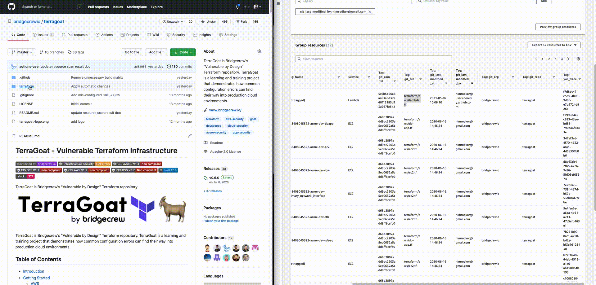

# Tagging Use Cases
Resource tagging enables complete traceability between build time and run time resources.
Using custom tags allows organizations to tag resources to match the development cycle, development flow, or the organization's structure.
This section includes typical tagging use cases.

## Tracing Code to Cloud

In order to locate your run time resource that was created based on a specific IaC resource, use the ```yor_trace``` tag of the target 
resource in build time. Then, search for this tag in relevant cloud console or CLI. The example below shows the results of searching for a tagged 
resource in a GitHub repository in an AWS console.


## Tracing Cloud to Code

In order to locate your IaC resource that created a given run time cloud resource, use ```git_file``` tag of this resource and navigate to relevant path. 
You can also search for the ```yor_trace``` value in your repository. The example below shows the results of searching for a tagged resource in an AWS console 
in a GitHub repository.



## Resource Ownership

Use the ```git_last_modified_by``` and ```git_last_modified_At``` tags in your run time resources to determine who and when a 
IaC resource was last modified. Using the ```git_modifiers``` tag to display a list of all the modifiers. 


## Additional Use Cases Using Yor Custom Taggers
Custom tags provide organizations with the ability to trace resources based on a custom tagging strategy.

### Console Organization:
You can tag specific resources within your IaC files using specific tags in order to use console tools such as AWS Resource Groups.
Resources can be consolidated and viewed for applications based on tag filtering. 

### Access Control:
Tag resources based on user Identity and Access Management (IAM) policies across providers. This enables customers to 
constrain permissions based on specific tags and their values. For example, you can deny an IAM user or role access to specific environments 
(for example, development, test, or production) based on tags.

### Cost Allocation:
You can tag resources for input into cost analytics tools. Typically, customers use business tags such as cost center, business unit, 
or project to associate AWS costs with traditional financial reporting dimensions within their organizations. 
